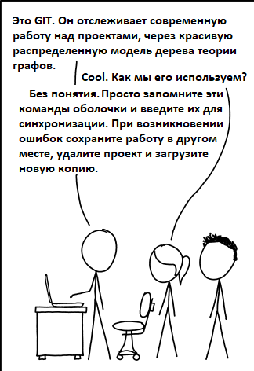

# Статья про Git



## Что же такое Git?

"Это - система управления версиями".

## Зачем он мне нужен?

"Для контроля версий, глупенький"

Хорошо, хорошо, я пока не слишком полезен. Основная идея такова: Проекты становятся слишком большими и количество участников тоже велико, поэтому становится невозможным отследить, кто, какой проект сделал и когда.

Кто-то внес изменение, которое повредило всю систему? Как вы выясняете, какое сделано изменение? Как вы возвращаетесь к тому, как было прежде? Назад к неповрежденной стране чудес? Я предприму дальнейшие шаги  — скажу нет проекту с большим количеством участников, только маленький проект, в котором вы являетесь создателем, специалистом по обслуживанию и дистрибьютором в одном лице: вы создаете новую программу для этого проекта, которая предусматривает различные ошибки, о которых вы узнаете позже. Вы не помните, что вы сделали изменения, согласно существующей кодовой базе, чтобы создать эту новую программу. Проблема? Решением этих проблем является внедрение новых версий!

Наличие версий для всего, что вы кодировали, гарантирует, чтобы вы с самого начала проекта знали, кто внес изменения, какие изменения внесены и где точно! И теперь, я призываю вас прекратить думать git как о черной коробки, откройте его и узнавать какие сокровища там ждут. Выясни как работает git, и у вас никогда не появится проблем, заставить вещи работать. Однажды вы пройдете через это, я обещаю, что Вы поймете безумие выполнения того, что говорит выше комик XKCD. Это точно то, что управление версиями пытается предотвратить.

## Как установить Git?

Я предполагаю, что вы знаете основные команды в Git, слышали о них или использовали их, хоть раз. В противном случае вот базовый словарь, чтобы помочь вам начать.

**Repository:** место для хранения вещей. С Git это означает вашу папку кода

**head:** "указатель" на последний код по которому вы работали.

**add:** действие, чтобы попросить, чтобы git отследил файл

**commit:** действие для сохранения текущего состояния  таким образом, что можно пересмотреть это состояние в случае необходимости

**remote:** не локальный репозиторий. Может быть в другой папке или в облаке (например: GitHub, BitBucket): помогает другим людям легко сотрудничать, поскольку они не должны доставать копию из Вашей системы, они могут просто получить его из облака. Кроме того, это гарантирует, что у вас есть резервное копирование в случае, повреждения вашего ноутбука.

**pull:** действие для получения обновленного кода от удаленного репозитория

**push:** действие для отправки обновленного кода в удаленный репозиторий

**merge:** действие для объединения двух различных версий кода

**status:** показывает информацию о текущем статусе репозитория

## Где хранится Git?

Магия управляется скрытой папкой: .git/
В каждом репозитории Git Вы будете видеть что-то вроде этого

```
$ tree .git/
.git/
├── HEAD
├── config
├── description
├── hooks
│   ├── applypatch-msg.sample
│   ├── commit-msg.sample
│   ├── post-update.sample
│   ├── pre-applypatch.sample
│   ├── pre-commit.sample
│   ├── pre-push.sample
│   ├── pre-rebase.sample
│   ├── pre-receive.sample
│   ├── prepare-commit-msg.sample
│   └── update.sample
├── info
│   └── exclude
├── objects
│   ├── info
│   └── pack
└── refs
    ├── heads
    └── tags
8 directories, 14 files
```

Это то, как Git управляет всем Вашим проектом. Мы войдем во все важные части, один за другим.
Git состоит из 3 частей: объектно-ориентированная память, индекс и рабочий каталог.

## Объектно-ориентированная память

Это то, как хранится все внутри Git. Для каждого файла вашего проекте, который вы добавляете, Git генерирует хэш для файла и хранит файл под тем хешем. Например, если я сейчас создаю `helloworld` файл и делаю `git add helloworld` (который говорит Git добавить файл, названный helloworld к объектно-ориентированной памяти), я получаю что-то вроде этого:

```
$ tree .git/
.git/
├── HEAD
├── config
├── description
├── hooks
│   ├── applypatch-msg.sample
│   ├── commit-msg.sample
│   ├── post-update.sample
│   ├── pre-applypatch.sample
│   ├── pre-commit.sample
│   ├── pre-push.sample
│   ├── pre-rebase.sample
│   ├── pre-receive.sample
│   ├── prepare-commit-msg.sample
│   └── update.sample
├── index
├── info
│   └── exclude
├── objects
│   ├── a0
│   │   └── 423896973644771497bdc03eb99d5281615b51
│   ├── info
│   └── pack
└── refs
    ├── heads
    └── tags
9 directories, 16 files
```

Сгенерирован новый объект! Для тех, кто заинтересован полазить внутри устройства, Git внутренне использует объектную команду hash-object так

```
$ git hash-object helloworld
a0423896973644771497bdc03eb99d5281615b51
```

Да, это тот же хеш, который мы видим под папкой объектов. Почему подкаталог с первыми двумя символами хеша?

**Это делает поиск быстрее.**

Затем Git создает объект с именем как вышеупомянутый хеш, сжимает наш файл и хранит его там. Следовательно, также на самом деле можно видеть содержание объекта!

```
$ git cat-file a0423896973644771497bdc03eb99d5281615b51 -p
hello world!
```

Это все внутри устройства. Вы никогда не использовали бы cat-file в поседневном добавлении. Вы просто добавляете и даете Git обработать все остальное.

`Git add`, создает хеш, сжимает файл и добавляет сжатый объект к объектно-ориентированной памяти.

## Рабочий каталог

Название наводит на мысль, что это то, где вы работаете. В рабочем каталоге находятся все файлы, которые вы создаете и редактируете. Я создал новый файл, `byeworld` и выполнил `git status`

```
$ git status
On branch master
No commits yet
Changes to be committed:
(use "git rm --cached <file>..." to unstage)
new file:   helloworld
Untracked files:
(use "git add <file>..." to include in what will be committed)
byeworld
```

Незарегистрированные файлы – это такие файлы в рабочем каталоге, которым мы не попросили, чтобы управлял git. Если не было никаких изменений в рабочем каталоге, то мы получаем следующее сообщение:

```
$ git status
On branch master
nothing to commit, working tree clean
```

которое я вполне уверен, вы понимаете теперь. Фишка в том, что рабочее дерево (каталог) является чистым.

## Индекс

Это ядро Git. Также известный как область технологической подготовки. Индекс хранит отображение файлов к объектам в объектно-ориентированной памяти. Это то, куда входит `commits`. Лучший способ увидеть это явление, проверить его!

Давайте продемонстрируем добавление файла `helloworld`

```
$ git commit -m "Add helloworld"
[master (root-commit) a39b9fd] Add helloworld
1 file changed, 1 insertion(+)
create mode 100644 helloworld
```

Назад к нашему дереву:

```
$ tree .git/
.git/
├── COMMIT_EDITMSG
├── HEAD
├── config
├── description
├── hooks
│   ├── applypatch-msg.sample
│   ├── commit-msg.sample
│   ├── post-update.sample
│   ├── pre-applypatch.sample
│   ├── pre-commit.sample
│   ├── pre-push.sample
│   ├── pre-rebase.sample
│   ├── pre-receive.sample
│   ├── prepare-commit-msg.sample
│   └── update.sample
├── index
├── info
│   └── exclude
├── logs
│   ├── HEAD
│   └── refs
│       └── heads
│           └── master
├── objects
│   ├── a0
│   │   └── 423896973644771497bdc03eb99d5281615b51
│   ├── a3
│   │   └── 9b9fdd624c35eee08a36077f411e009da68c2f
│   ├── fb
│   │   └── 26ca0289762a454db2ef783c322fedfc566d38
│   ├── info
│   └── pack
└── refs
    ├── heads
    │   └── master
    └── tags
14 directories, 22 files
```

О, как интересно! У нас есть 2 новых объекта в нашей объектно-ориентированной памяти и некоторый материал, который мы еще не понимаем в журнале. Возвращение к нашему другу `cat-file:`

```
$ git cat-file a39b9fdd624c35eee08a36077f411e009da68c2f -p
tree fb26ca0289762a454db2ef783c322fedfc566d38
author = <=> 1537700068 +0100
committer = <=> 1537700068 +0100
Add helloworld
$ git cat-file fb26ca0289762a454db2ef783c322fedfc566d38 -p
100644 blob a0423896973644771497bdc03eb99d5281615b51 helloworld
```

Как можно предположить, первый объект является метаданными фиксации: кто сделал, что и зачем с деревом. Второй объект, фактическое дерево. Если Вы поймете файловую систему Unix, Вы будете знать точно, что это.
`Tree` в Git соответствует файловой системе Git. С каждой фиксацией используется либо дерево (каталог) или блоб (файл BLOB). Также Git хранит древовидную информацию, для сообщения. Обратите внимание, что дерево указывает на конкретный объект каждого файла, которые оно содержит (хеш).

Пора говорить об ответвлениях! Наш первый commit добавил кое что еще к `.git/.` Нас интересует сейчас `.git/refs/heads/master:`

```
$ cat .git/refs/heads/master
a39b9fdd624c35eee08a36077f411e009da68c2f
```

Вот то, что необходимо знать об ответвлениях:
Ответвление в Git является легким подвижным указателем на один из коммитов. Имя ответвления в Git является основным по умолчанию.

А, что? Мне нравится думать об ответвлениях как о ветвлении в Вашем коде. Вы хотите внести некоторые изменения, но не хотите повредить (или взломать). Вы решаете иметь более сильное разграничение, чем журнал фиксации, и это то, куда входят ответвления. `master` является ответвлением по умолчанию, также используемым в качестве фактического производственного ответвления, т.е. та ветка, в который лежит основной код проекта, тот, который крутится в продакшене. Как можно предположить содержанием файла, он указывает на наш первый `commit`. Следовательно, это является указателем на `commit`

Давайте исследуем это далее. Скажем, я создаю новое ответвление:

```
$ git branch the-ending
$ git branch
* master
the-ending
```

Там у нас есть новое ответвление! Как Вы догадываетесь, новая запись, должна быть добавлена к `.git/refs/heads/` и так как нет никакого дополнительного `commit`, это должно указать также на наш первый `commit`

```
$ cat .git/refs/heads/the-ending
a39b9fdd624c35eee08a36077f411e009da68c2f
```

Да, точно! Теперь, вспомните `byeworld`! Тот файл был все еще не отслежен, поэтому неважно, что ветвь переходит к файлу, который всегда там был. Скажем, я хочу сейчас переключиться на это ответвление. Сделать это можно при помощи `checkout`.

```
$ git checkout the-ending
Switched to branch 'the-ending'
$ git branch
master
* the-ending
```

Теперь, внутри устройства, Git изменил все содержание рабочего каталога в соответствии содержанию,на которое указывает фиксация ответвления. На данный момент, он выглядит точно также как и master.

Допустим, я добавляю (`add`) и делаю коммит (`commit byeworld`).

Что Вы рассчитываете изменить в папке `objects`?

Что Вы рассчитываете изменять в папке `refs/heads`?

Подумайте об этом прежде чем двигаться дальше.

```
$ tree .git/
.git/
├── COMMIT_EDITMSG
├── HEAD
├── config
├── description
├── hooks
│   ├── applypatch-msg.sample
│   ├── commit-msg.sample
│   ├── post-update.sample
│   ├── pre-applypatch.sample
│   ├── pre-commit.sample
│   ├── pre-push.sample
│   ├── pre-rebase.sample
│   ├── pre-receive.sample
│   ├── prepare-commit-msg.sample
│   └── update.sample
├── index
├── info
│   └── exclude
├── logs
│   ├── HEAD
│   └── refs
│       └── heads
│           ├── master
│           └── the-ending
├── objects
│   ├── 0b
│   │   └── 17be9dbc34c5a5fbb0b94d57680968efd035ca
│   ├── a0
│   │   └── 423896973644771497bdc03eb99d5281615b51
│   ├── a3
│   │   └── 9b9fdd624c35eee08a36077f411e009da68c2f
│   ├── b3
│   │   └── 00387d818adbbd6e7cc14945fdf4c895de6376
│   ├── d1
│   │   └── 8affe001488123b496ceb34d8b13b120ab4cb6
│   ├── fb
│   │   └── 26ca0289762a454db2ef783c322fedfc566d38
│   ├── info
│   └── pack
└── refs
    ├── heads
    │   ├── master
    │   └── the-ending
    └── tags
17 directories, 27 files
```

3 новых объекта: 1 для добавления, 2 для фиксации! Имеет смысл? Как Вы думаете, что содержат объекты?

- Метаданные фиксации
- Добавление содержимых объекта
- описание дерева

Последней частью изображения является то, как фиксируется работа метаданных с предыдущими метаданными (метаданными) фиксации. Ну, `cat-file`!

```
$ git cat-file 0b17be9dbc34c5a5fbb0b94d57680968efd035ca -p
100644 blob d18affe001488123b496ceb34d8b13b120ab4cb6 byeworld
100644 blob a0423896973644771497bdc03eb99d5281615b51 helloworld
$ git cat-file b300387d818adbbd6e7cc14945fdf4c895de6376 -p
tree 0b17be9dbc34c5a5fbb0b94d57680968efd035ca
parent a39b9fdd624c35eee08a36077f411e009da68c2f
author = <=> 1537770989 +0100
committer = <=> 1537770989 +0100
add byeworld
$ git cat-file d18affe001488123b496ceb34d8b13b120ab4cb6 -p
Bye world!
$ cat .git/refs/heads/the-ending
b300387d818adbbd6e7cc14945fdf4c895de6376
```

Указатель на родительский элемент связывает фиксации (коммиты) вместе.

И Вы видите реализацию ответвления? Это указывает на фиксацию, самую последнюю, которую мы сделали после проверки! Конечно, владелец должен все еще указывать на фиксацию helloworld, правильно?

```
$ cat .git/refs/heads/master
a39b9fdd624c35eee08a36077f411e009da68c2f
```

Хорошо, мы через многое прошли, давайте суммировать.

## TL; DR

Git работает с объектами. Сжатой версией файлов, которые Вы просите, чтобы Git отследил.

Каждый объект имеет идентификатор (хеш, сгенерированный git на основе содержания файла).

Каждый раз, когда вы добавляете файл, git добавляет новый объект к объектно-ориентированной памяти. Именно поэтому вы не можете иметь дело с очень большими файлами в git. Он, сохраняет каждый раз весь файл, когда вы добавляете изменения, без различия (вопреки широко распространенному мнению).

Каждая фиксация создает 2 объекта:

1. **Дерево:** идентификатор для дерева, которое действует точно как каталог Unix: это указывает на другие деревья (каталоги) или blob (файлы): Это создает всю структуру каталогов на основе объектов, существующих в то время. Блобы представлены текущими объектами, созданными, путем add.
2. **Метаданные фиксации:** идентификатор для фиксации, кто сделал фиксацию, дерево, которое представляет фиксацию, сообщение о фиксации и родительскую фиксацию. Формирует соединяющий структуры связанного списка фиксации. Ответвления являются указателями для фиксации объектов метаданных, все сохраненные в `.git/refs/heads`

В следующей части мы пройдем некоторые действия Git, которые снятся людям в ночных кошмарах.
`reset, merge, pull, push, fetch` и как они изменяют внутреннюю структуру в `.git/.`

Перевод статьи: https://link.medium.com/re8cG2jXTR by Volkova Svetlana
