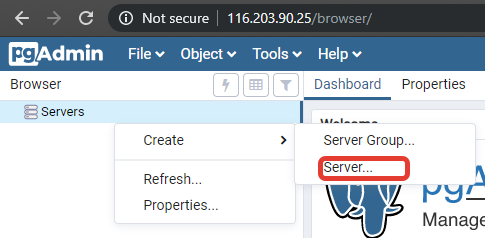
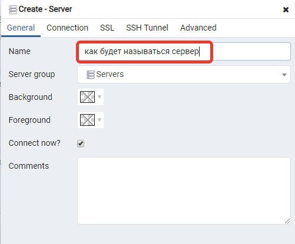
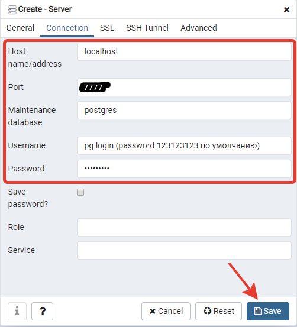

# Получение доступа

Зайдите на:

http://95.217.232.188/pgadmin4

Данные приведены в таблице ниже, если какие-то проблемы - напишите:

1. Если работаете через интерфейс pgAdmin, то вам надо залогиниться при помощи логина (в таблице ниже), пароль - 123123123. После первого входа смените его (в правом углу написан логин, нажать на него и change password). PgAdmin просто требует, чтоб логин был почтой, поэтому добавлено @m.com которое не несёт смысловой нагрузки

| Логин             |
| ----------------- |
| belousov@m.com    |
| vetchinova@m.com  |
| voloshina@m.com   |
| gazetova@m.com    |
| katjushina@m.com  |
| kozina@m.com      |
| orlov@m.com       |
| skornjakova@m.com |
| sharapova@m.com   |
| jamshhikov@m.com  |
| anisimova@m.com   |
| biruleva@m.com    |
| kudrjashov@m.com  |
| kurnakov@m.com    |
| magala@m.com      |
| rogachev@m.com    |
| sasin@m.com       |
| smolina@m.com     |
| bazhenov@m.com    |
| golovina@m.com    |
| dzugaev@m.com     |
| zhiharev@m.com    |
| pechnikov@m.com   |
| popov@m.com       |
| sergeev@m.com     |
| trefanjuk@m.com   |
| frolova@m.com     |
| shirokih@m.com    |
| abramova@m.com    |
| bogdanova@m.com   |
| goncharova@m.com  |
| guskova@m.com     |
| makarova@m.com    |
| orlova@m.com      |
| ostrouhov@m.com   |
| pepeljaeva@m.com  |
| prozorova@m.com   |
| puzhenkov@m.com   |
| romanova@m.com    |
| svetlova@m.com    |
| fardzinov@m.com   |
| chugina@m.com     |

После успешного входа в pgAdmin подключитесь к серверу:

введите название,

- host: localhost
- port: 7777
- database: из таблицы, только без @m.com! (т.е. если логин от pgAdmin surname@m.com, то тут - surname)
- username: из таблицы, только без @m.com! (т.е. если логин от pgAdmin surname@m.com, то тут - surname)
- password: совпадает с username (например, surname)

После того как зашли используйте SQL команду чтобы сменить пароль (не забудьте изменить подключение к базе):

`ALTER ROLE surname PASSWORD 'newpasswordhere';`

Т.е. на скрине ниже, допустим ваш логин surname@m.com:

Maintenance database: surname
Username: surname
Password: surname

