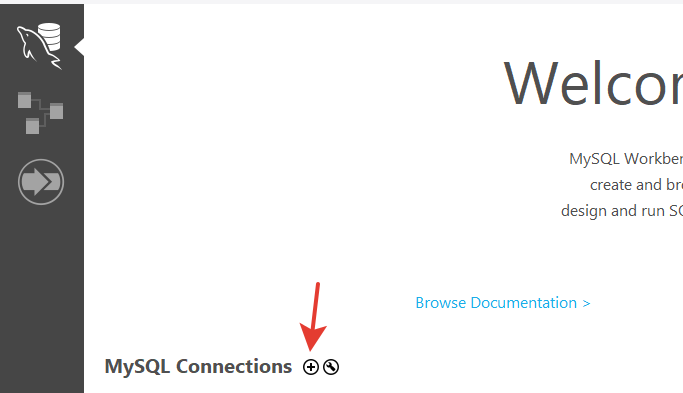
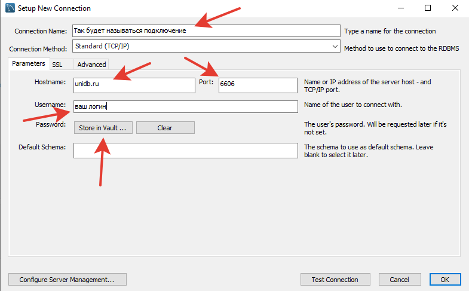
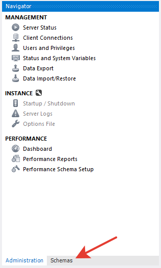
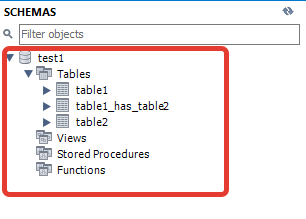
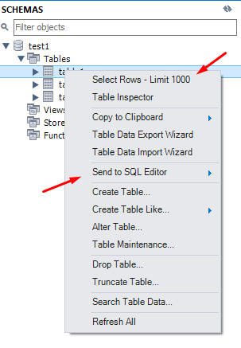
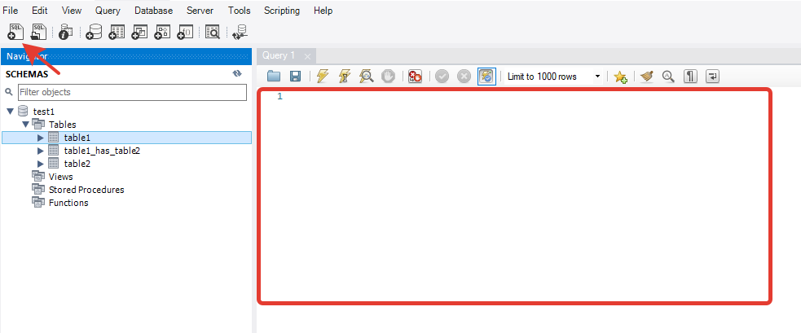
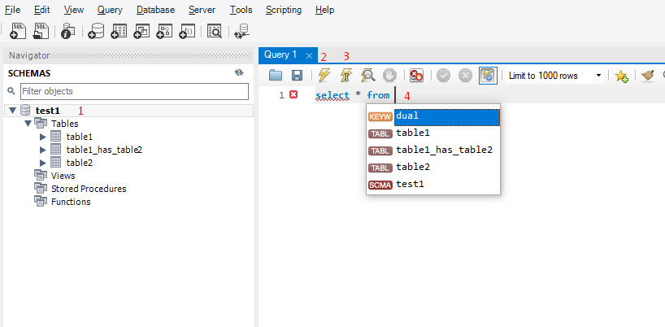

# Проекта №1

Проект выдаётся студентам, которые (требуется выполнение всех):

1. Познакомились с github и выкладывали туда задание
2. Выполнили примерно половину от 4 частей заданий
3. Набрали 10 и более баллов за задания

## Порядок выполнения

Задания 1 и 2 проекта выполняются на СУБД - MySQL.

Вы можете установить сервер MySQL локально, чтоб работать без интернета. Но сдача заданий только способом, описанным ниже:

1. Создать пользователя на [сайте](https://unidb.ru/#/) (**Примечание:** лучше ввести понятное имя пользователя (фамилию). Также запомните обязательно пароль, если его забудете ~~минус балл~~ придётся писать мне, чтобы я сбросил его на временный)
2. Установить себе [MySQL WorkBench](https://dev.mysql.com/downloads/workbench/)
3. [Инструкция по проектированию](#инструкция-по-проектированию)
4. [И концертация кода](#конвертация-кода)
5. [Сдать задание](#порядок-сдачи-и-получения-заданий)

### Порядок сдачи и получения заданий

1. Создать **приватный** репозиторий на github (или использовать репозиторий, в который выкладывали задания раньше, только поменять на приватный) - не забудьте добавить меня в collaborators. С момента объявления, что у вас есть проект (у первых есть ещё право выбора темы) 2 недели отводится на проектирование (старые задания тоже выполняются), время начинается с вашей пары, не важно, когда вы создали репозиторий (или поменяли старый на приватный), так что в ваших интересах сделать это быстро.
2. Подождать, когда я выложу 1-ую часть проекта - проектирование БД. Инструкция в этом файле есть.
3. После выполнения в репозиторий на github выкладывайте - mwb файл - сохраненный проект mysql workbench, скрипт создания таблиц в формате sql, фото спроектированной таблицы. Назовите коммит "project1 p1", например. Чтобы я понял, что это проект и стоит посмотреть в первую очередь.
4. Это вы должны сделать в течение 1-ой недели с момента получения. Я проверяю, говорю об ошибках, которые надо устранить за следующую неделю (если их нет, то сразу получите 2-ую часть 1-го проекта).
5. После получения замечаний, недели исправлений, сдаёте задания и получаете итоговый балл за эту часть (также могут быть ещё замечания, это уже влияет на итоговый балл в отрицательную сторону, но их надо исправлять). **Проектирование идёт вместе, а не вместо основного материала. Поэтому их тоже надо выполнять в течение этих двух недель, иначе баллы за задания идти не будут.**
6. После получения итогового балла за проектирование - в ваш репозиторий добавится вторая часть проекта - запросы. **Эта часть идёт уже вместо основных запросов.** Делаете запросы и выкладываете по мере сделанного. На эту часть тоже выделяется 2 недели (а кто смог сдать проектирование сразу после 1-ой недели, то на неделю больше времени на запросы)
7. Выкладываете запросы на github, получаете за них баллы.

- **За каждый проект примерно 20 баллов**
- **Если вы получаете проект заметно позже (10 неделя и позже), то шанс заработать много баллов очень низок**
- **Срыв срока сдачи проекта отрицательно сказывается на количестве полученных баллов**
- **Бэкап базы делается раз в день ночью, поэтому если вы что-то где-то накосячили, то восстановить можно, но лучше делайте собственные бэкапы, на всякий**

## Инструкция по проектированию

MySQL Workbench [Скачать](https://dev.mysql.com/downloads/workbench/). После нажатия на Download откроется страница, где надо будет авторизоваться, но ниже есть кнопка "No thanks, just start my download" - нажите её. Удобное средства для построения EER диаграммы и генерации SQL кода. Инструкция по применению - внизу этого документа.

**Инструкция:**
Тут описано как сделать само проектирование (ERR-диаграмму):

На диаграмму можно добавить таблицы и прочие объекты. Но нам нужны только таблицы

После нажатия двойным кликом на таблицу - её можно изменять. Поменять название, атрибуты, поставить первичный ключ и прочие параметры.

К таблице можно добавить внешний ключ.
Для этого необходимо выбрать нужный из списка слева. Нажать на ту таблицу, в которую будет добавлен новый атрибут - внешний ключ.
И после этого кликнуть на ту таблицу, из которой берём первичный ключ.
После этого ключ создан.

Отменить действией можно как и везде - ctrl+z

### Конвертация кода

Если вы подготовили EER-диаграмму, то можно сразу автоматически создать все таблицы.

1. Нажмите сверху Database - Syncronize model with Database.
2. В окне подключитесь к MySQL серверу. Host - unidb.ru, port: 6606, user - ваш*username*указанный при создании, password - ваш_пароль.
3. На этапе Select schemas выберите схему (по умолчанию ваша модель создаётся в mydb) - поставьте галочку и выберите эту строку. Снизу выберите название вашей базы данных (совпадает с username) и нажмите на override target. Next
4. После успешного получения всех объектов на этапе "Select Changes to Apply" у вас должна быть модель и Source (в источнике баз не должно быть, если вы не делаете эту операцию ещё раз)
5. Review DB Changes - на этом этапе скопируйте весь код в файл формата .sql - позже добавите его в репозиторий, для удобства моей проверки.
6. Если всё сделали правильно, то ошибок возникнуть не должно (бывает появляется что-то типа VISIBLE ... - вернитесь на предыдущий этап и удалите прям из кода это слово)

### Работа с таблицами

Необходимо создать подключение, как на этапе конвертации кода

Указать все параметры, название подключения (оно будет сохранено), пароль тоже можно сохранить в хранилище, чтоб не вводить каждый раз

Так выглядит подключение - нажмите и подключитесь (если ввели все данные правильно)

Скорее всего первым делом откроется окно Administration - там, например, вы можете сделать бэкап вашей базы. А вообще работать на вкладке - Schemas.

Если вы уже конвертировали данные, то увидите похожу картину (с вашими таблицами)

Некоторые полезные плюшки указаны ниже.

Писать запросы - таким образом

На скриншоте ниже:

1. Сделайте вашу схему активной, два раза кликнув на неё, чтобы не писать какждый раз название базы данных.
2. Выполнить полностью запрос (горячие клавиши - ctrl+enter)
3. Выполнить только часть (где находится курсор, до ближайшей `;`) (горячие клавиши - ctrl+shift+enter)
4. MySQL workbench делает некоторые подсказки

