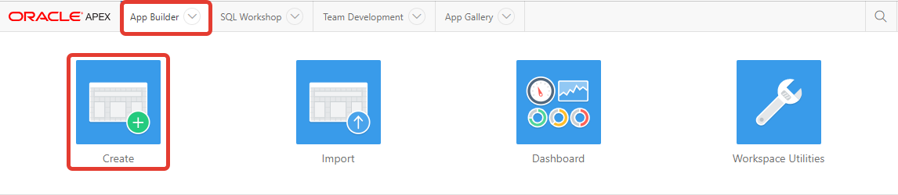
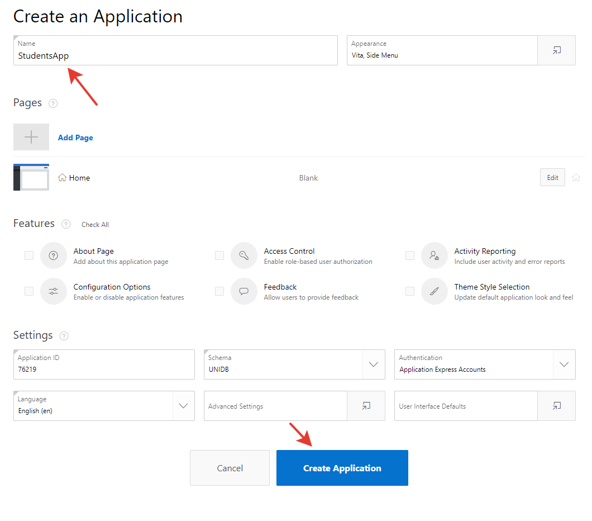
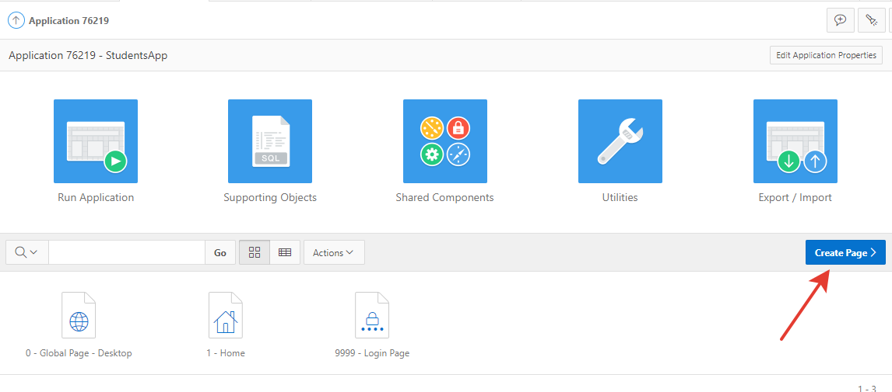
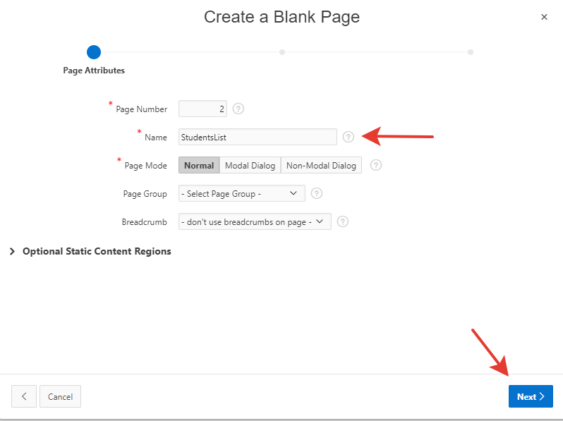
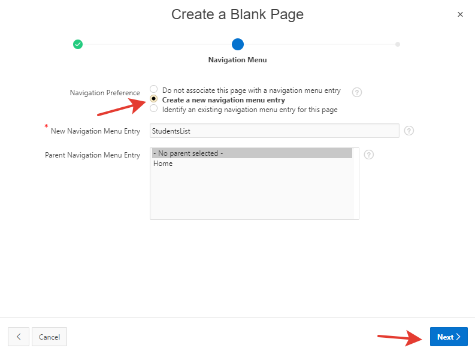
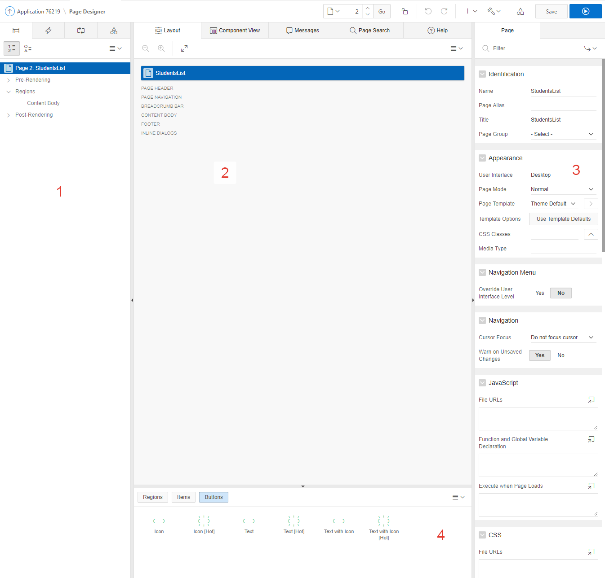
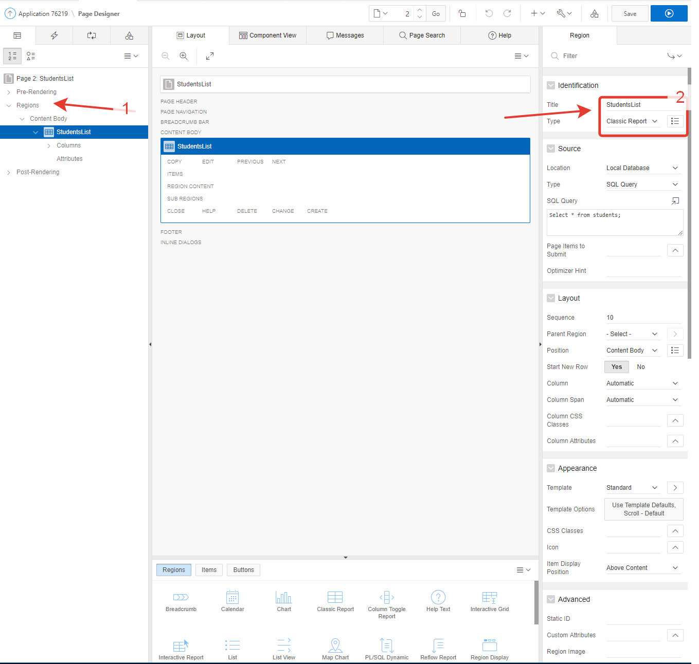
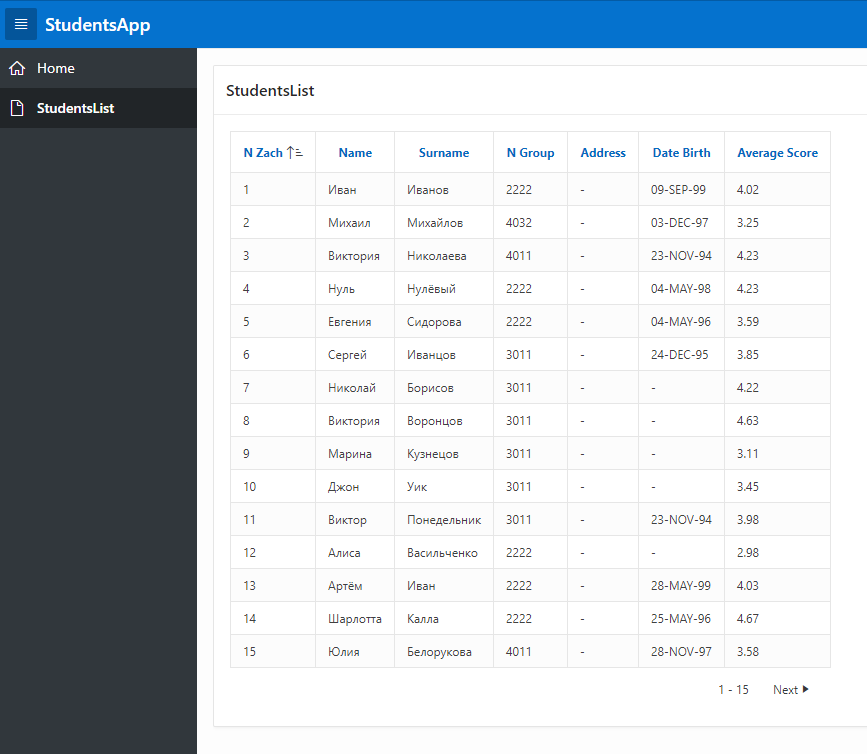
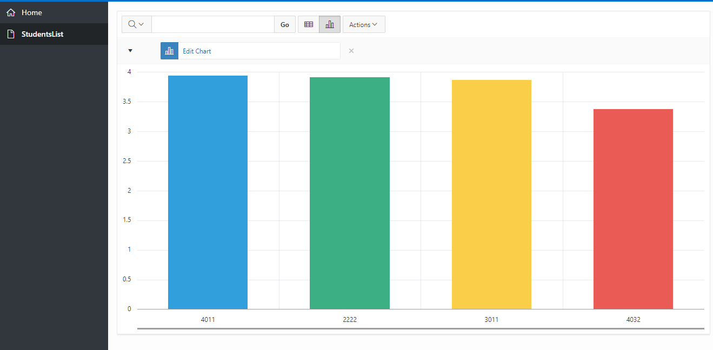

# Пример создания приложения в apex oracle

Создание приложения в oracle совсем не сложно и является хорошим способом сразу применить написанные DML запросы сразу в рабочем приложении.

Допустим, у нас имеются предварительно спроектированные и созданные таблицы: students, stud_hobby, hobby

```sql
CREATE TABLE  "STUDENTS"
   (	"N_ZACH" NUMBER(5,0),
	"NAME" VARCHAR2(150),
	"SURNAME" VARCHAR2(150),
	"N_GROUP" NUMBER(4,0),
	"ADDRESS" VARCHAR2(200),
	"DATE_BIRTH" DATE,
	"AVERAGE_SCORE" NUMBER(3,2),
	 CONSTRAINT "STUDENTS_PK" PRIMARY KEY ("N_ZACH")
  USING INDEX  ENABLE
   )
/
CREATE TABLE  "HOBBY"
   (	"ID" NUMBER(5,0),
	"NAME" VARCHAR2(150),
	"RISK" NUMBER(3,2),
	 CONSTRAINT "HOBBI_PK" PRIMARY KEY ("ID")
  USING INDEX  ENABLE
   )
/
CREATE TABLE  "STUD_HOBBY"
   (	"N_ZACH" NUMBER(5,0),
	"ID" NUMBER(5,0),
	"DATE_START" DATE,
	"DATE_FINISH" DATE,
	 CONSTRAINT "STUD_HOBBY_CON_PK" PRIMARY KEY ("N_ZACH", "ID")
  USING INDEX  ENABLE
   )
/
ALTER TABLE  "STUD_HOBBY" ADD CONSTRAINT "STUD_HOBBI_FK" FOREIGN KEY ("N_ZACH")
	  REFERENCES  "STUDENTS" ("N_ZACH") ENABLE
/
ALTER TABLE  "STUD_HOBBY" ADD CONSTRAINT "STUD_HOBBI_FK1" FOREIGN KEY ("ID")
	  REFERENCES  "HOBBY" ("ID") ENABLE
/
```

Создадим новое приложение



Выберите New Application и назовите ваше приложение, затем создайте его.



После создания вы увидите варианты управления приложением. Можете запустить его. Если вы не изменяли никакие настройки, то для авторизации вам будет необходимо ввести почту и пароль такой же, как от учётной записи oracle.

Давайте создадим новую страницу blank page



Это будет страничка, где мы отобразим список всех студентов. Назовём её StudentsList и создадим.



Сразу выберем, чтобы страничка отображалась в навигации и подтвердите, что всё верно.



После создания вы увидите несколько рабочих областей. Слева (1 на скриншоте) во вкладке Rendering создаются все элементы, области и прочее.

2 - тут можно расположить элементы на странице, сверху есть несколько вкладок - в component view будут нами созданы некоторые события.

3 - тут выбираются различные настройки элементов страницы

4 - набор различных элементов управления, которые можно перетащить в область 2.



Кликните правой кнопкой мыши на регион и создайте новый. Справа назовите его как-нибудь и выберите Type: Classic report.

Снизу поменяются варианты управления объектом, в SQL Query напишите запрос. В данном случае просто запрос, выводящий всех студентов:

```sql
Select *
From students
```

Справа сверху сохраните приложение и обновите в новой вкладке (если уже запускали) или запустите заново.



В приложении перейдите на созданную страницу и увидите примерно такое же на экране.



Вы можете попробовать другие type. Например, Interactive report выглядит интереснее и предоставляет больше возможностей и позволяет строить различные диаграммы и графики, множество фильтров и прочее. Или Interactive Grid



Создадим ещё одну страницу добавления новых студентов


