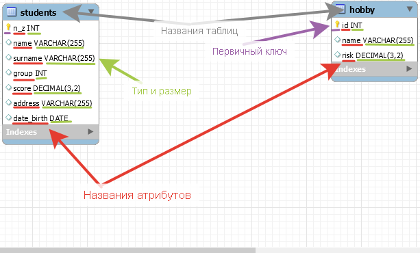
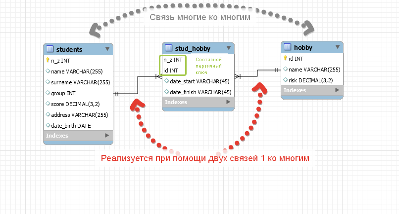
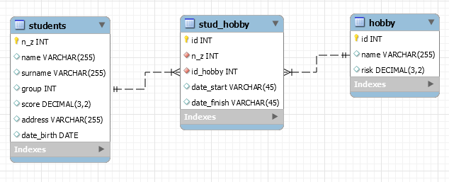
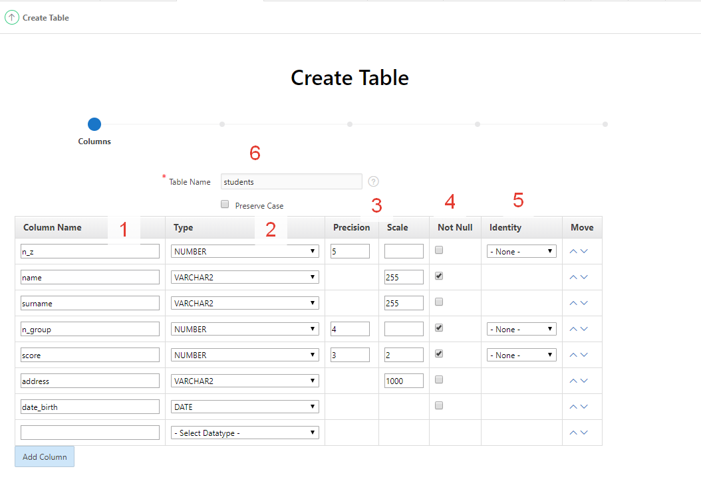
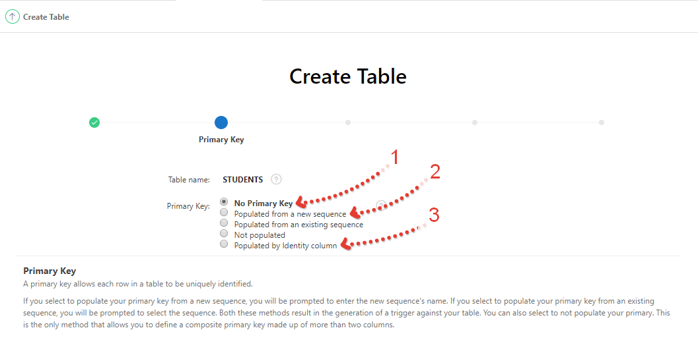
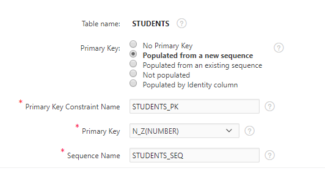
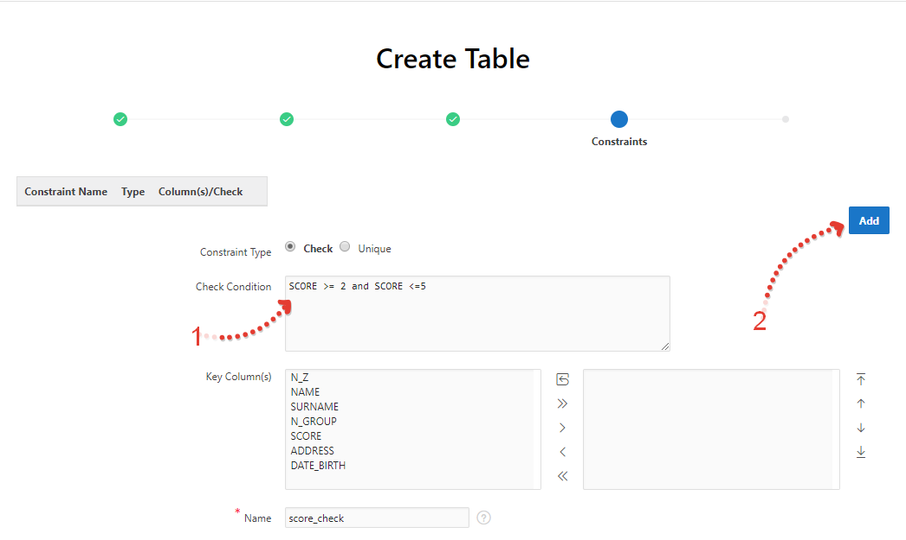
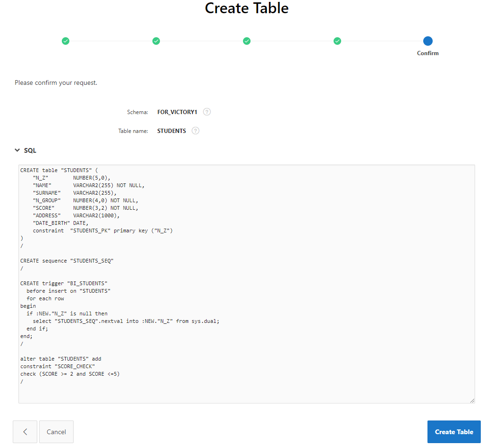
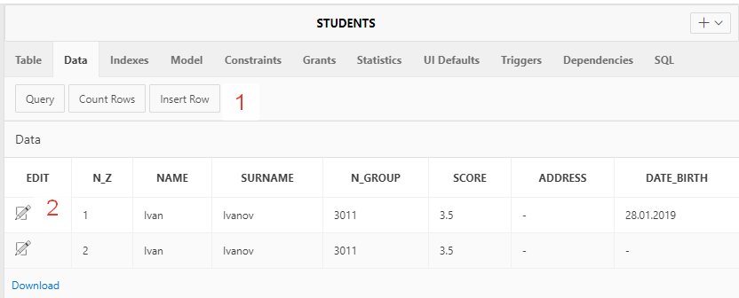

# Создание первых таблиц

Описание слабоформализованной задачи:

Необходимо хранить студентов - их имя, фамилию, номер группы, средний балл, адрес и дату рождения, а также каждый студент может заниматься разными хобби, у которого есть риск. Студент может как заниматься хобби в данный момент, так и уже закончить. Надо знать когда он начал и когда закончил.

Формализованное описание:

Для решения поставленной задачи нам понадобится таблица студентов. Нам необходимо как-то идентифицировать студента. Конечно, мы можем это сделать по имени, фамилии и прочим характеристикам, но это не даст нам 100% гарантии, что не встретится точно такой же другой студент. Поэтому введём уникальный атрибут - номер зачётки. И весь список атрибутов выглядит следующим образом:

- номер зачётки (id)
- имя
- фамилия
- номер группы
- средний балл
- адрес
- дата рождения

Также необходимо хранить хобби. Говорится, что у него есть риск. Аналогично - нам нужно уникально идентифицировать хобби. Сделаем первичным ключем id.

- id
- название хобби
- риск

На рисунке ниже можно увидеть ERR диаграмму, сделаную в MySQL Workbench. Тут немного отличаются типы данных от Oracle, но в целом суть одинаковая.



Наши таблицы необходимо связать. Если мы подумаем логически, то студент может заниматься множеством хобби, однако также и одним хобби может заниматься множество студентов. Получается, между двумя таблицами связь многие ко многим. Такую связь практически нереально реализовать на практике. Тут она реализуется при помощи двух связей один ко многим. Для этого нам необходимо создать 3-ую таблицу. В 3 таблице есть составной первичный ключ (номер зачётки и ид хобби), а также 2 атрибута - дата начала и окончания (прим. тут ошибка на скрине, может потом поправлю. Тип данных этих атрибутов должен быть DATE).



Составной первичный ключ на номер зачётки и ид хобби может создать некую проблему. При таком проектирование получается, что в таблице не может присутствовать более 1 одинаковой пары id & id. Получается, если студент начал заниматься хобби, закончил, а потом решил заняться снова, то заново добавить будет невозможно.

В таком случае есть выход - создать id для первичного ключа (см картинку ниже (тут такая же проблема - date_start, date_finish должны иметь тип DATE))



## Создание таблиц в PostgreSQL

### Типы данных

https://www.postgresql.org/docs/12/datatype.html

**Numeric:**
https://www.postgresql.org/docs/12/datatype-numeric.html

**Используйте тип serial для первичного ключа!**
В PostgreSQL serial - автоинкрементированный тип, т.е. он будет увеличиваться на 1 с каждой добавленной записью. Такое поведение можно сделать при помощи Integer, но тогда придётся в ручную создать последовательность. Serial не совсем тип данных, это скорее короткая запись. Поэтому в таблицах, которые ссылаются на таблицу с serial должен использоваться уже тип integer (bigserial -> bigInt соответственно)!!!

https://www.postgresql.org/docs/12/datatype-numeric.html#DATATYPE-SERIAL

**Date/Time:**
timestamp without time zone
timestamp with time zone
date
time without time zone
time with time zone
interval

**character:**
varchar(n) - текст с n - максимальным значением символов
text - текст без ограничений длины

### Create

#### PRIMARY KEY

Создание первичного ключа и дополнительных ограничений на атрибуте:

Так создать первичный ключ можно, если он не составной и не требуется лично установить название ключа (также в примере присутствую NOT NULL (делает атрибут не нулевым) и UNIQUE (значения атрибута должны быть только уникальными)):

```sql
CREATE TABLE supplier (
	id serial PRIMARY KEY,
	name varchar(255),
	city varchar(100),
	street varchar(100),
	house varchar(20),
	phone varchar(20),
	email varchar(100) NOT NULL UNIQUE
)
```

Так можно создать первичный ключ, если требуется указать составной, т.е. (PRIMARY KEY (key_id, key2_id)) (пример просто аналогичный предыдущему):

```sql
CREATE TABLE supplier (
	id serial,
	name varchar(255),
	city varchar(100),
	street varchar(100),
	house varchar(20),
	phone varchar(20),
	email varchar(100) NOT NULL UNIQUE,
	PRIMARY KEY(id)
)
```

Если требуется задать название ключа:

```sql
CREATE TABLE supplier (
	id serial,
	name varchar(255),
	city varchar(100),
	street varchar(100),
	house varchar(20),
	phone varchar(20),
	email varchar(100) NOT NULL UNIQUE,
	CONSTRAINT supplier_id_pk PRIMARY KEY (id)
)
```

#### Foreign Key

Допустим, мы хотим добавить таблицу supplier_info, в которой есть ссылка на таблицу supplier. Это можно сделать следующими способами:

1. На той же строчке, что и атрибут, без упоминания атрибута с которым связываем. Удобно, когда в supplier не составной первичный ключ. (Обратите внимание, что supplier_id - integer, а не serial! Это важно)

```sql
CREATE TABLE supplier_info (
	id serial PRIMARY KEY,
	supplier_id integer REFERENCES supplier,
	info varchar(5000)
)
```

2. На той же строке, но с указанием атрибута, с которым связываем

```sql
CREATE TABLE supplier_info (
	id serial PRIMARY KEY,
	supplier_id integer REFERENCES supplier (id),
	info varchar(5000)
)
```

3. Внутри Create Table, но уже после указания атрибутов. Этот вариант даёт возможность самостоятельно назвать внешний ключ

```sql
CREATE TABLE supplier_info (
	id serial PRIMARY KEY,
	supplier_id integer,
	info varchar(5000),
	CONSTRAINT supplier_info_supplier_id_fk FOREIGN KEY (supplier_id)
		REFERENCES supplier (id)
)
```

## Заполнение данными

```sql
INSERT INTO supplier (name, city, street, house, phone, email)
VALUES ('Шашкова, Лыткин and Мухин', 'Якушеваchester', 'Марина пл.', '181', '(958)743-94-34', '.19@ya.ru');

```

Более подробно:

https://www.postgresql.org/docs/12/sql-insert.html

## Создание таблиц в Oracle

Конечно, вы можете использовать чистый код для создания таблиц. DDL оператор CREATE.

Лучший варианты делать ERR диаграммы и автоматически генерировать код.

Однако для 1-го раза мы воспользуемся средствами графического интерфейса, который предоставляет apex Oracle.

Посмотрите на картинку ниже

1. Названия атрибутов. **Будьте внимательны** - в качестве названия атрибута нельзя использовать зарезервированные слова в oracle в качестве названий. Например: group, order, select, from, where, count etc.
2. Тип данных. Для цифр используется Number, для текста - VARCHAR. Максимальный размер Number - 38 символов (указывается в precision обязательно). Максимальный размер VARCHAR - 4000, указывается в Scale обязательно. Если надо хранить гораздо больше символов, есть другие типы, например различные BLOB.
3. Для цифр - Precision - сколько всего символов. Не путайте, это не максимально число, а максимальное количество символов. В id у нас максимальное число это 99999. В scale указывается сколько из чисел, указанных в precision идут после запятой. Т.е. в атрибуте score максимальное число может быть 9,99. А не 999,99 - это неверно.
4. Некоторые атрибуты будут не нулевые. Т.е. у студента должно быть имя обязательно, иначе добавить мы его не можем. Должна быть группа и средний балл. Остальные атрибуты могут и null равны (мы не выбрали id, но как мы сделаем его первичным ключом он станет не нулевым автоматически)
5. Каждому атрибуту можно сделать значение по умолчанию. Т.е. если мы при заполнении его не указали, оно будет равно default значению.
6. Ну и назвать табличку не забудьте, да.



Далее открывается окно выбора первичного ключа. Тут есть несколько вариантов

1. Без первичного ключа - если у вас в таблице нет первичного ключа, то скорее всего вы накосячили где-то в проектировании. Первичный ключ позволяет гарантировать уникальность данных в таблице, а также ускорить поиск (точнее поиск ускоряется за счёт индексов, которые по умолчанию создаются по первичному ключу).
2. Этот вариант примерно означает следующее: пользователь вообще не парится какой там дать новой записи ид. В MySql, например, это реализуется при помощи атрибута AUTO INCREMENT. В Oracle это реализуется при помощи последовательности (sequences) и триггера (triggers). В данном случае нам не надо сильно разбираться в работе, вы можете сделать это самостоятельно или этот момент будет затронут в следующем семестре.
3. Ну и последний вариант - у нас будет первичный ключ, который мы должны будем заполнять на каждом шаге.

Выберем 2 вариант. Пускай он заполняет id за нас.





Выберем первичный ключ - это номер зачётки.

Обратите внимание. Если вы выберите последний вариант, то тут можно указать составной ключ. С последовательность такого нет. Это можно реализовать, но в этом мало смысла.

Когда вы будете создавать таблицу хобби, вы поступите точно также, как сейчас, также и таблица студенты хобби. Однако если бы мы оставили составной первичный ключ, то мы бы не могли использовать последовательность. Мы бы выбрали последний 5-ый вариант и указали бы несколько первичных ключей.

Дальше, в таблице студенты нет никакого внешнего ключа.

Внешний ключ идёт из дочерней таблицы к родительской. Студенты являются как раз родительской.

По внешнему ключу выжный нюанс. Он не соединяет таблицы в том виде, как понимают студенты. Он никак не влияет на запросы, на их синтаксис. Если бы у нас в таблицах не было ни первичных, ни внешних ключей, ни индексов, то в первую очередь это бы повлияло на целостность данных. Каким-то образом в таблицу могли бы попасть студенты, с одинаковым номером зачётки. Также в таблице студенты хобби могли оказаться несуществующие студенты, занимающиеся несуществующими хобби. Это нарушает целостность данных, а без гарантирования целостности данных ваши данные ничего не стоят. Именно для этого нужен внешний ключ - обеспечение целостности данных.

Нажмите на кнопку Next внизу. Constraints.

### Check

Ещё один вариант обеспечения целостности - Домен. Или Check - это область допустимых значений (ОДЗ). На каждый атрибут можно повесить дополнительные условия проверки (тип данных и размер - это тоже вариант проверки целостности данных). Мы сделали, что средний балл может бы от 0,00 до 9,99 (выбрав тип данных - Number, Precision - 3, Scale - 2). Но балл может принимать значения от 2,00 до 5,00. Мы можем минимизировать ошибки при помощи домена.



На последнем этапе надо подтвердить выполнение кода.

Вы можете развернуть и посмотреть, что именно создалось.



```sql
CREATE table "STUDENTS" (
    "id"        NUMBER(5,0),
    "NAME"       VARCHAR(255) NOT NULL,
    "SURNAME"    VARCHAR(255),
    "N_GROUP"    NUMBER(4,0) NOT NULL,
    "SCORE"      NUMBER(3,2) NOT NULL,
    "ADDRESS"    VARCHAR(1000),
    "DATE_BIRTH" DATE,
    constraint  "STUDENTS_PK" primary key ("id")
)
/

CREATE sequence "STUDENTS_SEQ"
/

CREATE trigger "BI_STUDENTS"
  before insert on "STUDENTS"
  for each row
begin
  if :NEW."id" is null then
    select "STUDENTS_SEQ".nextval into :NEW."id" from sys.dual;
  end if;
end;
/

alter table "STUDENTS" add
constraint "SCORE_CHECK"
check (SCORE >= 2 and SCORE <=5)
/
```

Т.е. у нас создаётся таблица, с указанными названиями атрибутов, типами и первичный ключ.

Затем создаётся последовательность и триггер для автоматического заполнения id при заполнении таблицы. Я поясню, что происходит в триггере. Это язык pl/sql. Триггер выполняется до (`before`) добавления (`insert`) в таблицу. Триггер выполняется для каждой строки (`for each row`) дальше открывается выполняемая секция (всё, что между `begin` & `end`). Если новое значение, добавляемое в id равно null (т.е. не указано), то взять из последовательности следующее значение и положить в id. Затем `insert` продолжит выполняться.

И последнее - создаётся CHECK. Если попытаться в score добавить значение выше или ниже указанных, то будет выведена ошибка.

Жмём создать таблицу и вуаля. Она появилась, мы можем делать на неё запросы, а также увидеть её в Object Browser.

Код, указанный выше можно и создать в ручную, без пользовательского интерфейса. Т.е. прям написать, как он написан выше.

**Примечание:** при создании таблицы вы можете увидеть, что Oracle добавляет двойные кавычки в названия таблиц, атрибутов. Если вы оставите также и будет в названиях использовать только большие буквы, то всё будет хорошо. Однако если будете использовать маленькие буквы и другие посторонние символы, то вам в запросах придётся писать именно так, как вы добавляли в таблицу, т.е. `"Students"`, например.

В общем, если создаёте руками, то лучше вообще не использовать кавычки, т.е. делать так:

```sql
CREATE table STUDENTS (
    id        NUMBER(5,0),
    NAME       VARCHAR(255) NOT NULL,
    SURNAME    VARCHAR(255),
    N_GROUP    NUMBER(4,0) NOT NULL,
    SCORE      NUMBER(3,2) NOT NULL,
    ADDRESS    VARCHAR(1000),
    DATE_BIRTH DATE,
    constraint  STUDENTS_PK primary key (id)
)
/

CREATE sequence STUDENTS_SEQ
/

CREATE trigger BI_STUDENTS
  before insert on STUDENTS
  for each row
begin
  if :NEW.id is null then
    select STUDENTS_SEQ.nextval into :NEW.id from sys.dual;
  end if;
end;
/

alter table STUDENTS add
constraint SCORE_CHECK
check (SCORE >= 2 and SCORE <=5)
/
```

Поехали дальше. Нам надо создать таблицу с Хобби.

Не буду подробно останавливаться в этот раз. Всё можно увидеть на нашей спроектированной диаграмме. Аналогично таблице student. Мы хотим сделать риск от 0 до 10 и 2 знака после запятой, в этом случае понадобится размер `Number(4,2)` и домен с ограничением от 0 до 10

```sql
CREATE table HOBBIES (
    id        NUMBER(5,0),
    NAME       VARCHAR(255) NOT NULL,
    RISK    NUMBER(4,2) NOT NULL,
    constraint  HOBBIES_PK primary key (id)
)
/

CREATE sequence HOBBIES_SEQ
/

CREATE trigger BI_HOBBIES
  before insert on HOBBIES
  for each row
begin
  if :NEW.id is null then
    select HOBBIES_SEQ.nextval into :NEW.id from sys.dual;
  end if;
end;
/

alter table HOBBIES add
constraint RISK_CHECK
check (RISK >= 0 and RISK <= 10)
/
```

Теперь эти 2 таблицы мы хотим связать, чтобы у нас была возможность указывать какой студент каким хобби занимается. Здесь нам необходимо добавить два внешних ключа, чтобы мы не могли указать студента, который не существует или указать, что он занимается хобби, которого не существует.

```sql
CREATE table STUDENTS_HOBBIES (
    id          NUMBER(5,0) NOT NULL,
    id         NUMBER(5,0) NOT NULL,
    hobby_id    NUMBER(5,0) NOT NULL,
    DATE_START  DATE NOT NULL,
    DATE_FINISH DATE,
    constraint  STUDENTS_HOBBIES_PK primary key (id)
)
/

CREATE sequence STUDENTS_HOBBIES_SEQ
/

CREATE trigger BI_STUDENTS_HOBBIES
  before insert on STUDENTS_HOBBIES
  for each row
begin
  if :NEW.id is null then
    select STUDENTS_HOBBIES_SEQ.nextval into :NEW.id from sys.dual;
  end if;
end;
/

ALTER TABLE STUDENTS_HOBBIES ADD CONSTRAINT STUDENTS_HOBBIES_FK
FOREIGN KEY (id)
REFERENCES STUDENTS (id)

/
ALTER TABLE STUDENTS_HOBBIES ADD CONSTRAINT STUDENTS_HOBBIES_FK1
FOREIGN KEY (hobby_id)
REFERENCES HOBBIES (id)

/
```

## Заполнение таблиц

Есть вариант через программный интерфейс - можете попробовать.



В object browser открыть вашу таблицу. Выбрать вкладку Data:

1. Insert row - добавить строку
2. Edit - можно изменить, там же можно нажать на кнопку Delete, чтобы удалить.

Но это не самый удобный вариант. Лучше - через код.

Более подробно описано [тут](../../Theory/2_SQL/DML.md#INSERT)

Пример

```sql
Insert into student (name, surname, n_group, score, address, date_birth) values ('Ivan', 'Ivanov', 2253, 4.8, 'г. Дубна, пр-кт. Боголюбова, д.15, кв.31', '28/01/2000')
```

добавит новую строку в таблицу студенты. Если вы хотите выполнить много insert, то либо воспользуйте [SQL Scripts](../README.md) пункт 17

или может помочь следующая конструкция

```sql
Insert ALL
  INTO student () VALUES ()
  INTO student () VALUES ()
  INTO student () VALUES ()
Select * FROM DUAL
```

Dual - системная таблица, которая возвращает 1 строку и 1 столбец.
