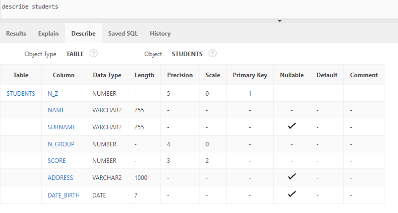

# Задания по курсу

Они могут изменяться/дополняться во время семестра, поэтому советую подписаться на репозиторий (watch сверху), чтобы получать уведомление на почту после каких-либо изменений. Вы можете увидеть что именно было изменено, зайдя в commits и посмотрев последние изменённые.

## Полезные советы

### Общие

1. Запросы можно комментировать: -- однострочный комментарий; /\* \*/ - многострочный (если многострочный стоит в начале или в конце запроса - скорее всего будет ошибка)

2. Ни в коем случае не используйте русский язык в названиях. Это можно сделать, но постоянно переключать раскладку - ужасно. Не делайте так!

3. Используйте [snake_case](https://ru.wikipedia.org/wiki/Snake_case) для названий.

4. Используйту UPPER_CASE для SQL команд (SELECT, FROM, AND, NULL)

5. Не забывайте про ограничения, что названия атрибутов не могут совпадать с зарезервированными словами - count, number и прочими.

6. Возьмите за привычку везде использовать псевдонимы. Возможно, этот пункт отложите на время, когда станет понятно о чём тут речь. Например

   ```sql
   SELECT s.*
   FROM student s, students_hobbies sh
   WHERE s.id = sh.id
   ```

   тут всё хорошо, но например мы хотим вывести студентов, которые занимались, но закончили заниматься хобби

   ```sql
   SELECT s.*
   FROM student s, students_hobbies sh
   WHERE s.id = sh.id AND date_finish IS NOT NULL
   ```

   Этот код отлично отработает, но если вы откроете его спустя какое-то время и вы сразу не сможете вспомнить структуру таблиц, то он вас вгонит в ступор. Что такое date_finish? У нас две таблицы, в какой из них он находится? А если запрос не на 2 таблицы, на 30? Выяснить из какой таблицы этот атрибут становится крайне сложно.

   Другое дело, если бы мы заранее написали запрос так:

   ```sql
   SELECT s.*
   FROM student s, students_hobbies sh
   WHERE s.id = sh.id AND sh.date_finish IS NOT NULL
   ```

   Всё ок. Сразу понятно, что date_finish из таблицы students_hobbies

   Приучите себя всегда писать из какой таблицы вы берёте значения. И начинайте сразу, даже если используете 1 таблицу.

7. По оформлению самих запросов. Не лепите всё в одну строчку. Как минимум каждый из операторов на новой строке. Также можно каждое условие на новой строке. [Удобный сервис](https://sqlformat.org/)

   ```sql
   SELECT
   FROM
   WHERE
   GROUP BY
   HAVING
   ORDER BY
   ```

8. SQL - декларативный язык программирования. Он не сложный сам по себе, но в первое время может быть сложно понять, как это работает. Т.е. мы не пишем как мы вытаскиваем данные. (абстрактный пример) Нам не надо писать, что мы бегаем по массиву в цикле, проверяем соответствует ли заданному условию значение и выводим на экран. Мы пишем

   ```sql
   SELECT - что ты хочешь увидеть на экране?
   FROM - откуда эти данные ты хочешь вытащить?
   ```

   Это минимальный запрос - что и откуда.
   Дальше идут необязательне параметры, но они могут использоваться. **Запомните, что порядок следования операторов строгий SELECT FROM WHERE GROUP BY HAVING ORDER BY.** 2-6 могут отсутствовать в запросе, но порядок не меняется.

   ```sql
   WHERE - условия отбора. Мы хотим вывести только те данные, которые соответствуют какому-то условию. Плюс тут может быть указано соединение таблиц
   ```

   Идём дальше. Допустим мы хотим написать запрос, который должен для каждой группы подсчитать количество студентов. Мы бы бегали циклом по массиву/словарю, проверяли чему равен номер группы, если тому, какой номер у нас есть в другом массиве, то в увеличивали количество на 1 и шли бы так до конца.

   Тут мы не указываем как мы это будем. Мы используем оператор группировки GROUP BY, в котором указываем какой атрибут мы будем группировать? N_GROUP. И существуют групповые операторы - count, min, max, sum, avg. Нам понадобится count(\*) или count(N_GROUP) и мы получим для каждой группы количество записей в таблице (в нашем случае - количество студентов.

   ```sql
   GROUP BY - оператор группировки.
   ```

   **Примечание:** в `GROUP BY` должны быть указаны все атрибуты, которые указаны в `SELECT` (кроме групповых), иначе будет ошибка. Подумайте логически почему так. Что мы хотим достать запросом, который в `SELECT` содержит больше атрибутов, кроме указанных в `GROUP BY`. Однако в `GROUP BY` могут присутствовать те атрибуты, которых нет в `SELECT`. Часто это может быть полезно, например вывести максимальное количество человек во всех группах. Номер группы нам не важен.

   ```sql
   HAVING - условие на групповые операторы
   ```

   Если `WHERE` относится к данным, которые лежат в таблице, то `HAVING` к тем данным, которые получаются в результате выполнения группового оператора. Т.е. мы хотим вывести не все группы, а те, в которых менее 8 студентов

   `HAVING count(*) < 8`

   Будьте внимательны, мы используем тут именно групповой оператор, а не псевдоним атрибута (т.е. `count(*)`, а не `students_count` как в примере ниже

   ```sql
   SELECT s.n_group, count(*) as students_count
   FROM student s
   GROUP BY s.n_group
   HAVING count(*) < 8
   ```

   Если мы хотим отсортировать, то используем последний оператор - `ORDER BY`. В нём мы перешисляем какие атрибуты сортировать, затем каким образом. По умолчанию используется asc - ascending - сортировка от меньше к большему, от A до Z.

   Если мы хотим сортировать по убыванию, нам надо написать desc

   Пример от а до я:

   ```sql
   SELECT *
   FROM student s
   ORDER BY s.n_group
   ```

   ```sql
   SELECT *
   FROM student s
   ORDER BY s.n_group desc
   ```

   Более подробно ищете в разделе [Theory/5_Queries](../Theory/5_Queries)

9. В sql существует множество различных диалектов, поэтому в будущем при использовании не забудьте немного почитать документацию, чтоб понять что к чему

10. Если создаёте руками таблицы и прочее, не используйте двойные кавычки. Просто названия без кавычек. [Подробнее](./1_Tables_Creation)

### PostgreSQL

1. Выполнение запросов в PgAdmin - F5. Мы можете выделить код, который хотите запустить, соответственно выполнится только выделенная часть

### Oracle

1. По умолчанию в Oracle стоит американский формат даты - MM/DD/YYYY. Если вы хотите его поменять, то в правом верхнем углу Account Menu - Preferences. В поле Default Date Format ввести свой формат даты. Например - DD/MM/YYYY. После этого необходимо выйти и зайти заново - формат будет изменён.

2. При выходе/перезаходе в аккаунт Oracle закрывайте все вкладки с этой сессией. Если вы перезашли в одной вкладке, а потом захотите обновить старую, то из всех сессий вас выкинет и придётся заходить заново.

3. Выполнение запросов в sql commands - ctrl + enter

4. В SQL commands можно выполнять запрос не полностью, а только выделенную часть. Выделите нужный код и запустите.

5. Снизу вкладка History - в неё можно найти ранее запущенные запросы

6. Запрос можно сохранить - справа кнопка save. Необходимо ввести название запроса, в дальнейшем его можно будет открыть из вкладки Saved SQL снизу.

7. Иногда бывает полезно посмотреть информацию о таблице не лазяя в Object Browser - поможет оператор `describe table_name` 

8. Как в каждом языке программирования, так и в СУБД есть определенные [соглашения по именованию](https://oracle-base.com/articles/misc/naming-conventions).

   - Названия таблиц в множественном числе, если состоит из нескольких слов, то последнее должно быть в множественном числе. STUDENTS, HOBBIES, STUDENTS_HOBBIES

   - Псевдонимы (aliasing - as) - совет ORACLE сокращать до 4 символов. Максимальное количество символов в названии - 30. Чтобы не вводить каждый раз название таблицы полное - используются псевдонимы (для атрибутов это тоже возможно!). Запомните это, но в курсе использовать не обязательно. У нас не так много таблиц. Поэтому можно писать запрос так: `FROM student s, hobby h, students_hobbies sh`. По правилам Oracle нам необходимо сделать так: `FROM student stud, hobby hobb, students_hobbies stho`

   - атрибуты не должны начинаться с псевдонима или вообще с названия таблицы (однако есть ситуации, когда это полезнее, но точно не в нашем случае)

   - Ключи должны иметь название таблицы и оканчиваться на \_PK - primary key, \_UK - unique key, \_FK - foreign key. Example: STUDENTS_PK, STUDENTS_HOBBIES_FK. Однако бывает, что не хватает 30 символов, тогда можно использовать псевдоним - STHO_FK

   - Индексы для скорости должны вешаться на каждый внешний ключ (и первичный, конечно). Для внешнего ключа название такое: STUDENTS_HOBBIES_FK_I или STHO_FK_I

   - Последовательность - name_SEQ

   - Представление - name_V

9. Если вы хотите выполнить подряд несколько запросов, то SQL Commands это сделать вам не даст. Но есть SQL scripts, где вы можете создать новый и запустить. Каждый запрос разделяется ;
