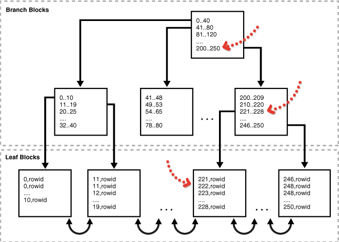

# Индексы

Индексы - важная часть баз данных. Именно благодаря им поиск в таблицах может осуществляться очень быстро. Пользователи не могут увидеть индексы, они только используются для ускорения поиска/запросов.

Однако индексами надо пользоваться аккуратно, т.к. в некоторых случае, при неправильном применении индексы наоборот могут показать результат хуже. Например, обновление таблицы с индексами займёт больше времени, что без, т.к. сами индексы тоже необходимо обновить. Поэтому необходимо использовать индексы на те атрибуты, по которым производится частый поиск.

Синтаксис создания индексов:

```sql
CREATE INDEX index_name
ON table_name (column1, column2, ...);
```

Есть несколько различных типов индексов.

## Би-дерево

Основной - это би-дерево (b-tree).


Например, мы пишем запрос, который выбирает студента с заданными номером зачётки:

```sql
SELECT *
FROM students
WHERE id = 222;
```

Если у нас нет никакого индекса в таблице, то поиск будет осуществляться полным перебором. Что на небольших данных незаметно, но когда таблица вырастает в объеме - этот момент становится критичным.

Вообще, пока у вас небольшое количество данных, то проектировать таблицы вы можете как угодно. Разница в скорости выполнении запросов не будет заметно невооруженным взглядом. Но когда данных становится больше, то появляется множество проблем, который очень сложно решить, если были допущены грубые ошибки на начальном этапе создания.

В итоге, без индекса будет произведено полное сканирование таблицы. По порядку, отбрасывая те строки, которые не соответствуют заданному критерию и оставляя те, которые соответствуют.

С индексом поиск по нашему запросу будет осуществлён таким образом:



Получается, мы смотрим в какой диапазон попадает наше значение и двигаемся по дереву до листа, где хранится строка, которая нам нужна.

Итак, в общем случае индексы необходимо использовать на атрибуты, которые:

- часто запрашиваются и возвращают небольшой процент от общего числа кортежей в таблице;
- на индексированном столбце или столбцах есть ограничение ссылочной целостности. Индекс - способ избежать полной блокировки таблицы, которая была бы необходима в случае обновления первичного ключа родительской таблицы, слияния с родительской таблицей или удаления из родительской таблицы;
- в таблице есть уникальный ключ и вы хотите вручную указать индекс и все его параметры.

На первичный и уникальный ключ индексы создаются автоматически, на внешний ключ можно создать индекс руками.

## Bitmap

В bitmap (битовая карта) индекс указывает на несколько строк, когда в би-дереве - на одну. Битмап индекс применяется для объединения двух или более таблиц.

Случаи, когда bitmap индекс может быть полезен:

- когда индексируемые столбцы имеют низкое кардинальное число. Т.е. отношение количества различных значений к количеству строк низкое.
- индексируемая таблица доступна только для чтения или не подвергается существенным изменениям в инструкциях DML.

Ну и также у нас должны быть запросы, которые часто выполняются именно на эти атрибуты.

Например, в таблице есть атрибут пол (как минимум 2 разных значения) и есть запросы, которые часто выполняются на этот атрибут. Таким образом это хорошее решение сделать битмап индекс на данный атрибут.

Если мы сделаем такой индекс и залезем под капот, то увидим что-то наподобии этого:

| Value | Row 1 | Row 2 | Row 3 | Row 4 | Row 5 | Row 6 | Row 7 |
| ----- | ----- | ----- | ----- | ----- | ----- | ----- | ----- |
| M     | 1     | 0     | 1     | 1     | 1     | 0     | 0     |
| F     | 0     | 1     | 0     | 0     | 0     | 1     | 1     |

Например, если мы добавим в таблицу студенты атрибуты пол и статус (учится, отчислен, академ)

И напишем такой запрос:

```sql
SELECT COUNT(*)
FROM students
WHERE gender = 'F'
  AND status IN ('учится',
                 'академ');
```

То битовая карта будет выглядеть следующим образом:

| Value                  | Row 1 | Row 2 | Row 3 | Row 4 | Row 5 | Row 6 | Row 7 |
| ---------------------- | ----- | ----- | ----- | ----- | ----- | ----- | ----- |
| M                      | 1     | 0     | 1     | 1     | 1     | 0     | 0     |
| F                      | 0     | 1     | 0     | 0     | 0     | 1     | 1     |
| учится                 | 0     | 0     | 0     | 0     | 0     | 1     | 1     |
| академ                 | 0     | 0     | 0     | 0     | 0     | 0     | 0     |
| учится или академ, и F | 0     | 0     | 0     | 0     | 0     | 1     | 1     |

## Function-based indexes

Функциональные индексы

Индекс этого типа включает столбцы, которые либо преобразуются [функцией](../6_Functions/README.md), либо включаются в какое-то выражение. Индекс на основе функций вычисляет значение функции или выражения, включающего один или несколько столбцов, и сохраняет его в индексе. Индекс на основе функций может быть либо бинарным деревом, либо индексом битмап.

Функция, используемая для построения индекса, может быть арифметическим выражением или выражением, которое содержит функцию PL/SQL, пользовательскую функцию и прочее.

Допустим, мы часто выполняем запрос, который выводит студентов заданного курса. По системе ИСАУ 1 цифра в номере группы - это курс. Запрос выглядит примерно так:

```sql
SELECT substr(n_group,0,1)
FROM students
WHERE substr(n_group,0,1) = 1
```

В таком случае имеет смысл создать индекс:

```sql
CREATE INDEX course_idx
ON students ( substr(n_group,0,1) );
```

## Domain indexes

Это не самый распространённый тип индексов, он устанавливается для специфичных приложений. Может использоваться для следующих целей:

- для сложных типов данных (документы, пространственные данные, изображения, видеоклипы)
- использование специальных методы индексации

Вообще, этот тип индекса достаточно сложен в применении и надо точно понимать зачем он необходим.
